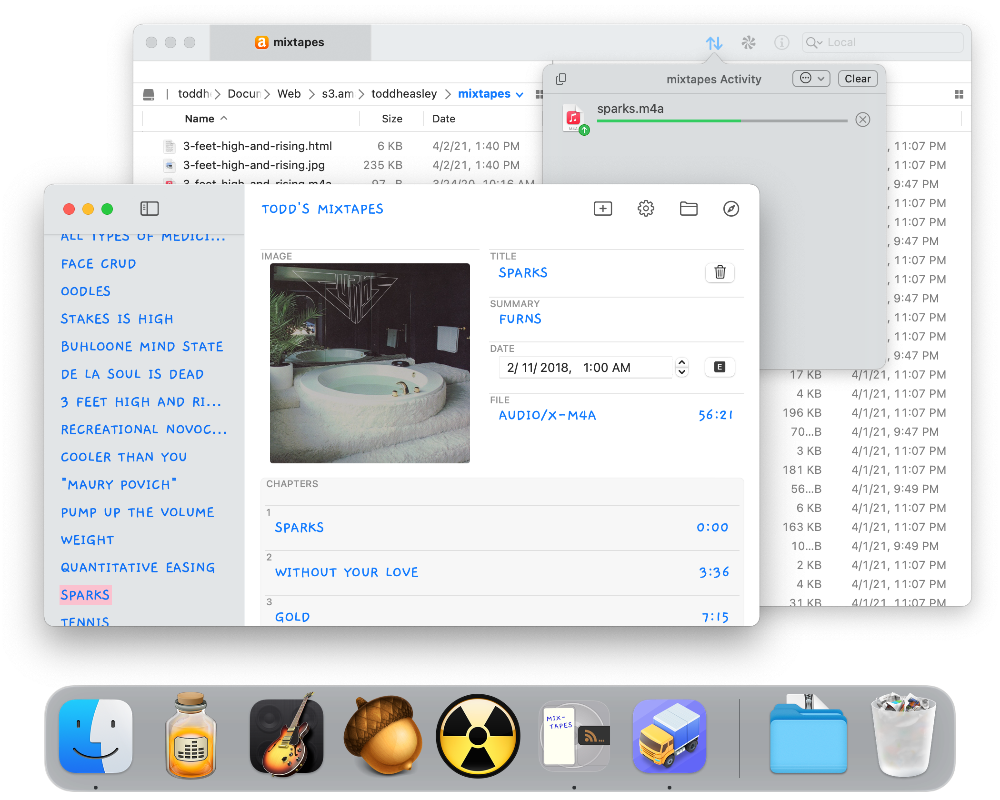

# Mixtapes

Mixtapes is a Mac app that I wrote to publish [my collection of personal mixtapes](https://s3.amazonaws.com/toddheasley/mixtapes/index.html) as a podcast. 

The app is built with [SwiftUI](https://developer.apple.com/xcode/swiftui) and a couple dabs of [AppKit](https://developer.apple.com/documentation/appkit) glue. Choose a folder and add MP3s. Mixtapes automatically derives album artwork and metadata from a handful of [required ID3 tags](mixtapes/README.md), then generates a complete static web site and RSS feed.

 

## Workflow

Mixtapes joins a workflow that includes a bunch of my favorite Mac apps:

* [Audio Hijack](https://www.rogueamoeba.com/audiohijack) - If you can't buy it, rip it.
* [GarageBand for Mac](https://www.apple.com/mac/garageband) - Mix and master.
* [Acorn](https://flyingmeat.com/acorn) - Cover art is half the fun of making a mixtape.
* [Fission](https://www.rogueamoeba.com/fission) - Tailor audio chapters and metadata.
* [Transmit](https://panic.com/transmit) - Upload to the cloud.

## Requirements

Targets [macOS](https://developer.apple.com/macos) 11 Big Sur. Written in [Swift](https://developer.apple.com/documentation/swift) 5.3 and requires [Xcode](https://developer.apple.com/xcode) 12 or newer to build.
