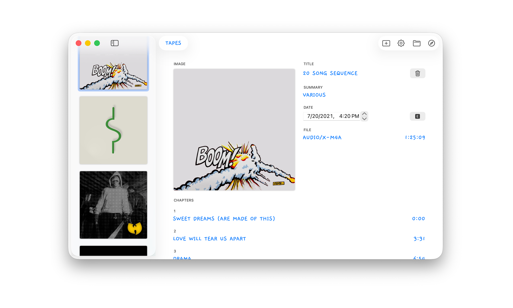

# Mixtapes

Mixtapes is a Mac app that I wrote to publish [my collection of mixtapes](https://s3.amazonaws.com/toddheasley/tapes/index.html) as a podcast. 

<picture>
  <source media="(prefers-color-scheme: dark)" srcset="docs/mixtapes-dark.png">
  
</picture>

## Requirements

Targets [macOS](https://developer.apple.com/macos) 26 Tahoe. Written in [Swift](https://developer.apple.com/swift) 6, and builds with [Xcode](https://developer.apple.com/xcode) 26 or newer.
